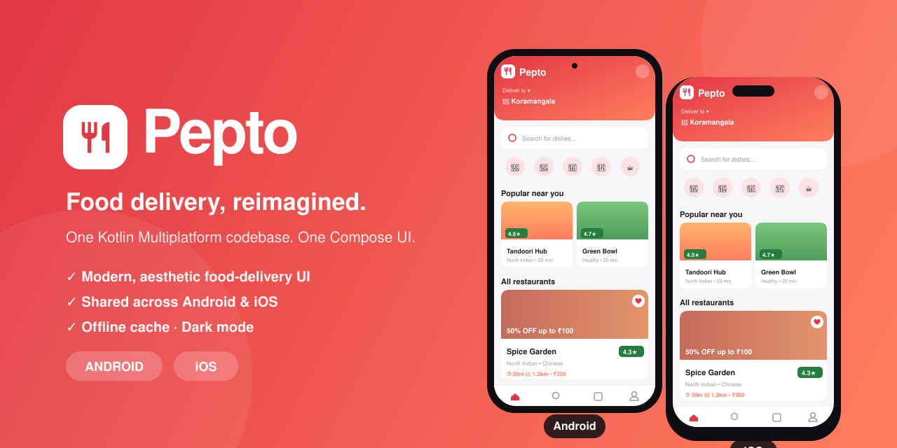
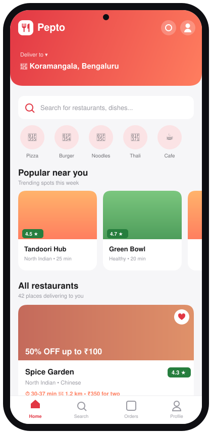
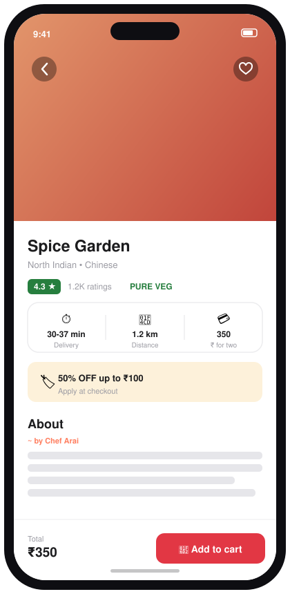

<p align="center">
  
</p>

<h1 align="center">🍲 Pepto</h1>

<p align="center">
  A modern, aesthetic <b>food‑delivery</b> app built with <b>Kotlin Multiplatform</b> and a single,
  shared <b>Compose Multiplatform</b> UI for <b>Android</b> &amp; <b>iOS</b>. 🚀
</p>

<p align="center">
  
  
  
  
</p>

---

## ✨ About

Pepto is a Zomato‑style food‑delivery front end with a clean, modern interface — a gradient
location header, search bar, food categories, a "Popular near you" carousel and restaurant cards
with ratings, delivery times and prices. It loads data from an API and caches it in a local
SQLite database, so content stays available offline and remote/local data stay in sync.

**Features**

- 🎨 Modern, aesthetic food‑delivery UI (Zomato‑style)
- 📱 One shared Compose UI across Android &amp; iOS
- 📵 Offline capability (SQLite cache)
- 🌓 Dark mode
- ✨ Pull‑to‑refresh &amp; shimmer loading

> The network API is a dummy (fixed) response, statically hosted
> [here](https://adit9852.github.io/DummyFoodiumApi/api/posts/).

## 📱 Preview

Pepto runs from the **same Compose codebase** on both platforms. Here's the home feed on Android
and the restaurant detail screen on iOS:

<table align="center">
  <tr>
    <td align="center"><b>Android</b><br/><sub>Home feed</sub></td>
    <td align="center"><b>iOS</b><br/><sub>Restaurant detail</sub></td>
  </tr>
  <tr>
    <td></td>
    <td></td>
  </tr>
</table>

> 💡 The images above are crafted mockups of the actual screens. To swap in **real screenshots**
> or an inline **demo video**, see [Adding your own demo media](#-adding-your-own-demo-media).

### ▶️ Demo video

<!--
  Record the app, then drag-and-drop the video into any github.com comment / PR / the README editor.
  GitHub uploads it and gives you a `https://user-images.githubusercontent.com/...mp4` link.
  Paste that link on its own line right here and GitHub will render an inline player.
-->
_Add your Android / iOS demo video here — see the guide below._

---

## 🛠️ Built with

- [Kotlin](https://kotlinlang.org) — Programming language
- [Kotlin Multiplatform](https://kotlinlang.org/docs/multiplatform.html) — Multi‑platform apps from a single codebase
- [Compose Multiplatform](https://www.jetbrains.com/lp/compose-multiplatform/) — Shared UI for Android &amp; iOS
- [Coroutines](https://github.com/Kotlin/kotlinx.coroutines) — Multithreading
- [Kotlinx Serialization](https://github.com/Kotlin/kotlinx.serialization) — JSON serialization/deserialization
- [Ktor Client](https://github.com/ktorio/ktor) — HTTP requests &amp; iOS image loading
- [SQLDelight](https://github.com/cashapp/sqldelight) — Local database / offline cache
- [Coil](https://github.com/coil-kt/coil) — Image loading on Android
- [Mutekt](https://github.com/patilshreyas/mutekt) — UI state management

## 🚀 Setting up the project

- Refer to the **"Setting up environment"** section of the
  [Compose Multiplatform template](https://github.com/JetBrains/compose-multiplatform-ios-android-template/blob/main/README.md).
- Clone this repository and open it in **Android Studio** (Electric Eel or newer).
- Build the project 🔨 and confirm everything works.
- Run the app:
  - Select **`androidApp`** as the run configuration → run the **Android** app.
  - Select **`iosApp`** (or use **Xcode**) → run the **iOS** app.

## 🗂️ Project structure

This Compose Multiplatform project includes three modules:

| Module | Description |
|--------|-------------|
| [`shared`](/shared) | Kotlin module with all shared logic **and** the shared Compose UI. The app's root `@Composable` lives in `shared/src/commonMain/kotlin/App.kt`. Builds into an Android library and an iOS framework. |
| [`androidApp`](/androidApp) | Builds the Android application; depends on `shared` as a regular Android library. |
| [`iosApp`](/iosApp) | Xcode project that builds the iOS application; depends on `shared` as a CocoaPods dependency. |

---

## 🎥 Adding your own demo media

Want real captures instead of (or alongside) the mockups? Here's the full recipe.

**Hero banner (the front image):**
- It's [`readme-media/graphic.svg`](/readme-media/graphic.svg) — edit the text/colours directly, or
  replace the `` line at the top with your own image.

**Screenshots:**

| Platform | Capture command |
|----------|-----------------|
| Android  | `adb exec-out screencap -p > readme-media/pepto-android.png` |
| iOS (Simulator) | `xcrun simctl io booted screenshot readme-media/pepto-ios.png` |

Then point the `` tags in the **Preview** table at your new `.png` files.

**Demo video (this is what *plays* inline):**
1. Record the screen
   - Android: `adb shell screenrecord /sdcard/demo.mp4` → `adb pull /sdcard/demo.mp4`
   - iOS Simulator: `xcrun simctl io booted recordVideo demo.mov`
2. GitHub does **not** play repo‑hosted `.mp4` files inline. Instead, open any **issue / PR / the
   README editor on github.com** and **drag‑and‑drop** your video into the text box.
3. GitHub uploads it and inserts a `https://user-images.githubusercontent.com/…​.mp4` link — paste
   that under **▶️ Demo video** and it renders as an inline player. 🎬

## 🤝 Contribute

Contributions are always welcome! See [Contributing Guidelines](CONTRIBUTING.md).

## 💬 Discuss

Questions, doubts or opinions? You're always welcome to
[start a discussion](https://github.com/adit9852/Foodium-KMM/discussions).

## 🙏 Acknowledgements

- [JetBrains/compose-multiplatform-ios-android-template](https://github.com/JetBrains/compose-multiplatform-ios-android-template#readme) — Starter template
- [google/accompanist](https://github.com/google/accompanist) — Placeholder (shimmer) APIs

## 📄 License

```
Copyright 2025 Aditya Kumar

Licensed under the Apache License, Version 2.0 (the "License");
you may not use this file except in compliance with the License.
You may obtain a copy of the License at

http://www.apache.org/licenses/LICENSE-2.0

Unless required by applicable law or agreed to in writing, software
distributed under the License is distributed on an "AS IS" BASIS,
WITHOUT WARRANTIES OR CONDITIONS OF ANY KIND, either express or implied.
See the License for the specific language governing permissions and
limitations under the License.
```
